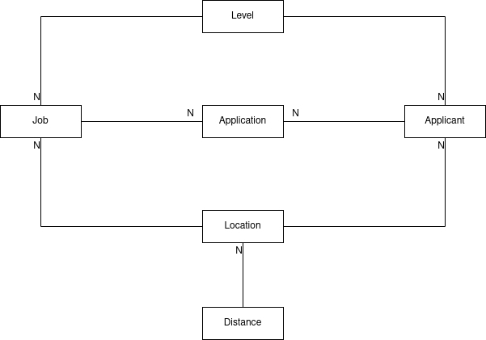

# Vagas Kt

Resolução do desafio técnico proposto pelo Vagas. 

## Requisitos

* openjdk >= 11
* kotlin >= 1.4.21
* gradle >= 6.7.1
* spring boot >= 2.4.2
* postgresql >= 12.6
* docker >= 19.03

## TLDR

Com os requisitos satisfeitos digite o comando abaixo para rápida execução.

    ./gradlew clean bootJar && sudo docker build . -t vagas-kt:1.0 && sudo docker run -p 9000:9000 -it vagas-kt:1.0

## Arquitetura

A arquitetura segue os padrões do spring, talvez a maior mudança seja o uso do Kotlin.
O spring foi escolhido por ser um framework de DI para facilitar os testes.

### Modelo

A criação da estrutura do banco de dados é feita pelo arquivo [creation.sql](scripts/creation.sql).

As entidades localização e distância armazenam o grafo representando a geolocalização do candidato e
da vaga. Foi escolhido o armazenamento das localizações no banco para permitir a fácil alteração do mapa. As localizações passadas
no enunciado são carregadas no banco de dados pelo arquivo [populate.sql](scripts/populate.sql)

O nível de experiência da vaga (Level) também foi armazenado no banco de dados. Apesar de não ser algo
que deve ser alterado frequentemente, é preferível deixá-la no banco do que usar enums. Também é carregado
pelo arquivo [populate.sql](scripts/populate.sql)

### Arquivos

Caminho | Descrição
--------|-----------
dtos.kt | transferência de dados e serialização
models.kt | entidades JPA
repositories.kt | helpers do Spring Data para manipulação de entidades
services.kt | implementação da api; cálculo de distância e ranking
controllers.kt | endpoints REST
application.kt | ponto de entrada do spring boot

### Testes

Teste | Alvo do teste
------|-------
DistanceTest | Cálculo de distância
RankTest | Cálculo do ranking
RestTest | Endpoints da API

A execução de testes é feita pelo gradle:

    ./gradlew test

## Build

O build é totalmente controlado pelo gradle

    ./gradlew bootJar

## Execução

O método de execução preferencial é usando o docker que fará o setup automático de
um postgresql efêmero.

### Criação do container

    sudo docker build . -t vagas-kt:1.0

### Execução do container

    sudo docker run -p 9000:9000 -it vagas-kt:1.0

